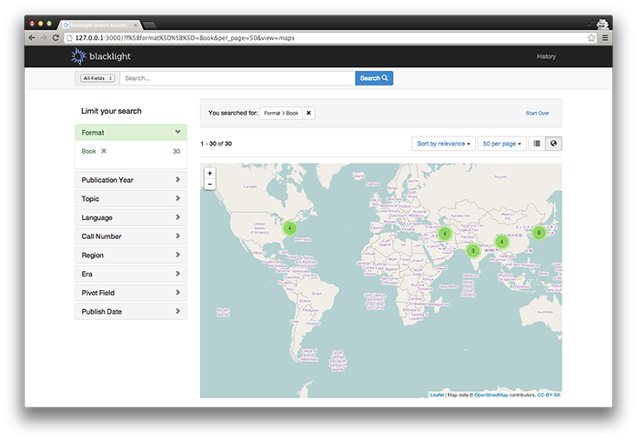
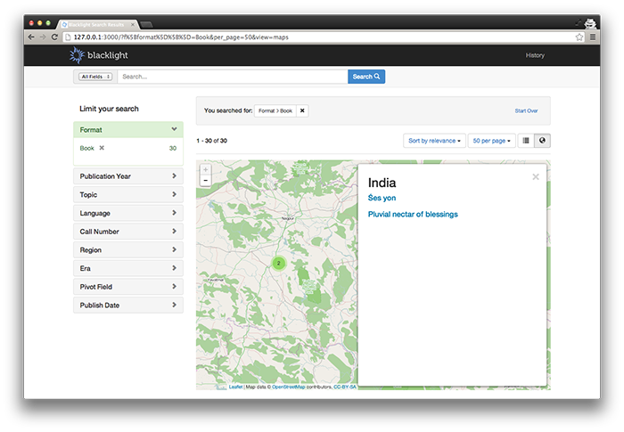

# Blacklight::Maps

[](https://travis-ci.org/sul-dlss/blacklight-maps)

Provides a map view for Blacklight search results.




## Installation

Add this line to your application's Gemfile:

    gem 'blacklight-maps'

And then execute:

    $ bundle

Or install it yourself as:

    $ gem install blacklight-maps

## Usage

Blacklight-Maps adds a map view capability for a results set that contains geospatial coordinates (latitude/longitude).

For now, Blacklight-Maps requires that your SOLR index includes a field containing placenames with latitude and longitude coordinates delimited by `|`.  This field can be multivalued.

A document requires the following field:
```  
  placename_coords:
    - China|35.86166|104.195397
    - Tibet|29.646923|91.117212
    - India|20.593684|78.96288
```

Note: We are looking at implementing support for additional fields.

### Configuration

#### Required
Blacklight-Maps expects you to provide:

- a field to map the placename coordinates (`placename_coords` in the example above)

#### Optional

- the maxZoom [property of the map](http://leafletjs.com/reference.html#map-maxzoom)
- a [tileLayer url](http://leafletjs.com/reference.html#tilelayer-l.tilelayer) to change the basemap
- an [attribution string](http://leafletjs.com/reference.html#tilelayer-attribution) to describe the basemap layer


All of these options can easily be configured in `CatalogController.rb` in the `config` block.

```
...
  configure_blacklight do |config|
    ## Default parameters to send to solr for all search-like requests. See also SolrHelper#solr_search_params
    config.default_solr_params = { 
      :qt   => 'search',
      :rows => 10,
      :fl   => '*'
    }

    ## Default values
    config.view.maps.placename_coords_field = "placename_coords"
    config.view.maps.tileurl = "http://{s}.tile.openstreetmap.org/{z}/{x}/{y}.png"
    config.view.maps.attribution = 'Map data &copy; <a href="http://openstreetmap.org">OpenStreetMap</a> contributors, <a href="http://creativecommons.org/licenses/by-sa/2.0/">CC-BY-SA</a>'
...

```


## Contributing

1. Fork it ( http://github.com/<my-github-username>/blacklight-maps/fork )
2. Create your feature branch (`git checkout -b my-new-feature`)
3. Commit your changes (`git commit -am 'Add some feature'`)
4. Push to the branch (`git push origin my-new-feature`)
5. Create new Pull Request
