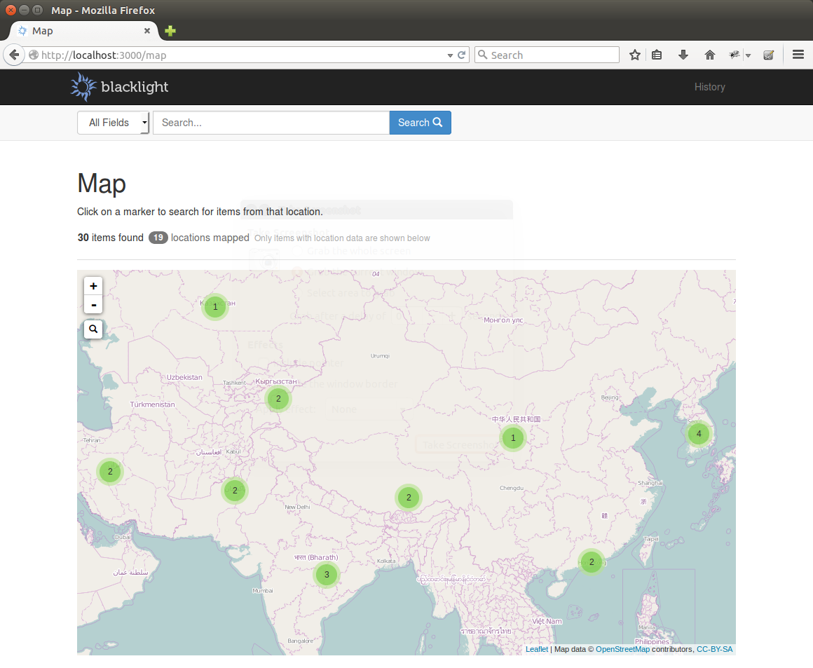
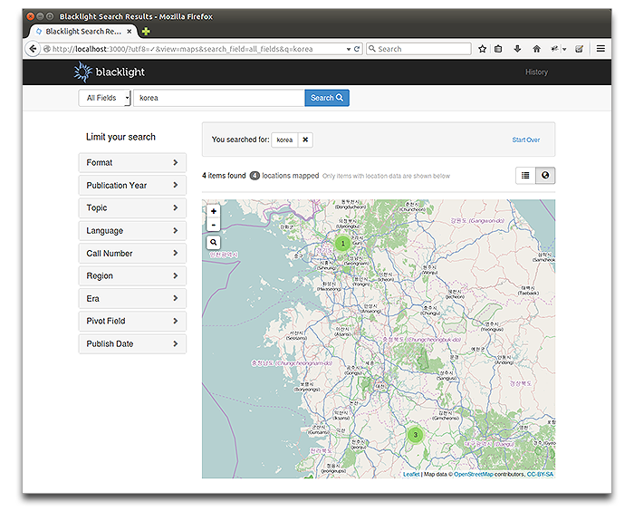
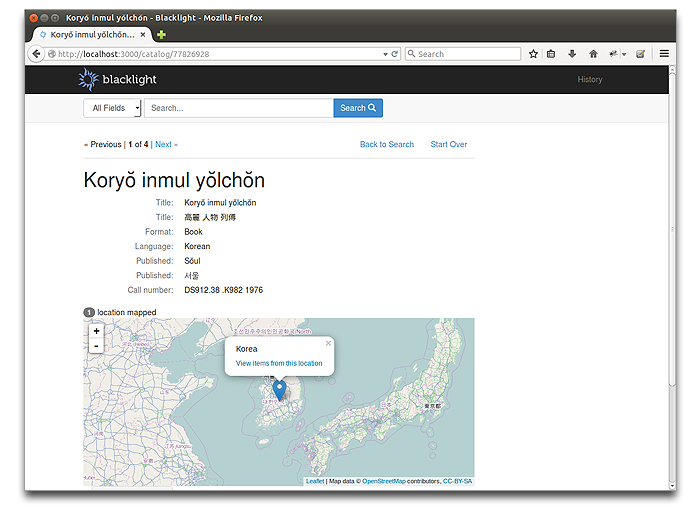

# Blacklight::Maps

[](https://travis-ci.org/sul-dlss/blacklight-maps) | [](https://coveralls.io/r/projectblacklight/blacklight-maps?branch=master)

Provides map views for Blacklight for items with geospatial coordinate (latitude/longitude) metadata.

Browse all records by 'Map' view:


Map results view for search results (coordinate data as facet):


Maplet widget in item detail view:


## Installation

Add this line to your application's Gemfile:

    gem 'blacklight-maps'

And then execute:

    $ bundle

Or install it yourself as:

    $ gem install blacklight-maps
    
Run Blacklight-Maps generator:
    
    $ rails g blacklight_maps:install

## Usage

Blacklight-Maps integrates [Leaflet](http://leafletjs.com/) to add map view capabilities for items with geospatial data in their corresponding Solr record.

In the map views, locations are represented as markers (or marker clusters, depending on the zoom level). Clicking on a marker opens a popup which (depending on config settings) displays the location name or coordinates, and provides a link to search for other items with the same location name/coordinates.

Users can also run a search using the map bounds as coordinate parameters by clicking the  search control in the map view. Any items with coordinates or bounding boxes that are contained within the current map window will be returned.

In the catalog#map and catalog#index views, the geospatial data to populate the map comes from the facet component of the Solr response. Bounding boxes are represented as points corresponding to the center of the box.

In the catalog#show view, the data simply comes from the main document. Points are represented as markers and bounding boxes are represented as polygons. Clicking on a polygon opens a popup that allows the user to search for any items intersecting the bounding box.

### Solr Requirements

Blacklight-Maps requires that your Solr index include at least one (but preferably BOTH) of the following two types of fields:

1. A `location_rpt` field that contains coordinates or a bounding box. For more on `location_rpt` see [Solr help](https://cwiki.apache.org/confluence/display/solr/Spatial+Search). This field can be multivalued.

  ```
  # coordinates: lon lat or lat,lon
  # bounding box: minX minY maxX maxY
  coordinates_field: 
   - 78.96288 20.593684
   - 20.593684,78.96288
   - 68.162386 6.7535159 97.395555 35.5044752       
  ```

2. An indexed, stored string field containing a properly-formatted [GeoJSON](http://geojson.org) feature object for a point or bounding box that includes the coordinates and (preferably) location name. This field can be multivalued.

  ```
  # first example below is for coordinate point, second is for bounding box
  geojson_ssim:
   - {"type":"Feature","geometry":{"type":"Point","coordinates":[78.96288,20.593684]},"properties":{"placename":"India"}}
   - {"type":"Feature","geometry":{"type":"Polygon","coordinates":[[[68.162386, 6.7535159], [97.395555, 6.7535159], [97.395555, 35.5044752], [68.162386, 35.5044752], [68.162386, 6.7535159]]]},"bbox":[68.162386, 6.7535159, 97.395555, 35.5044752]}
  ```

  If you have #2 above and you want the popup search links to use the location name as a search parameter, you also need:

3. An indexed, stored text or string field containing location names. This field can be multivalued.

  ```
   placename_field: India
  ```

##### Why so complicated?
Blacklight-Maps can be used with either field type (#1 or #2), however to take advantage of the full feature set, it is preferred that both field types exist for each item with geospatial metadata.

* The GeoJSON field (#2 above) provides reliable association of place names with coordinates, so the map marker popups can display the location name
* The Location name field (#3 above) allows users to run meaningful searches for locations found on the map
* The Coordinate field (#1 above) provides for the "Search" function on the map in the catalog#map and catalog#index views


**Important:** If you are NOT using the geojson field (#2), you should create a `copyField` in your Solr schema.xml to copy the coordinates from the `location_rpt` field to a string field that is stored, indexed, and multivalued to allow for proper faceting of the coordinate values in the catalog#map and catalog#index views.

```
  <!-- Solr4 location_rpt field for coordinates, shapes, etc. -->
  <dynamicField name="geospatial" type="location_rpt" indexed="true" stored="true" multiValued="true" />
  <!-- copy geospatial to string field for faceting -->
  <copyField source="geospatial" dest="geospatial_facet" />
```

Support for additional field types may be added in the future.

### Configuration

#### Required
Blacklight-Maps expects you to provide these configuration options:

+ `facet_mode`  = the type of field containing the data to use to display locations on the map (values: `'geojson'` or `'coordinates'`)
  - if `'geojson'`:
    + `geojson_field` = the name of the Solr field containing the GeoJSON data
    + `placename_property` = the key in the GeoJSON properties hash representing the location name
  - if `'coordinates'`
    + `coordinates_facet_field` = the name of the Solr field containing coordinate data in string format (`<copyField>` of `coordinates_field`)
+ `search_mode` = the type of search to run when clicking a link in the map popups (values: `'placename'` or `'coordinates'`)
  - if `'placename'`:
    + `placename_field` = the name of the Solr field containing the location names
+ `coordinates_field` = the name of the Solr `location_rpt` type field containing geospatial coordinate data

In addition, you must add the geospatial facet field to the list of facet fields:
```ruby
config.add_facet_field 'geojson_field', :limit => -2, :label => 'Coordinates', :show => false
```

#### Optional

- `show_initial_zoom` = the zoom level to be used in the catalog#show view map (zoom levels for catalog#map and catalog#index map views are computed automatically)
- `maxzoom` =  the maxZoom [property of the map](http://leafletjs.com/reference.html#map-maxzoom)
- `tileurl` = a [tileLayer url](http://leafletjs.com/reference.html#tilelayer-l.tilelayer) to change the basemap
- `mapattribution` = an [attribution string](http://leafletjs.com/reference.html#tilelayer-attribution) to describe the basemap layer
- `spatial_query_dist` = the radial distance, in kilometers, to search from a supplied coordinate point in a spatial search. This corresponds to the `d` [Spatial Filter](https://cwiki.apache.org/confluence/display/solr/Spatial+Search) parameter in Solr. 


All of these options can easily be configured in `CatalogController.rb` in the `config` block.

```ruby
...
  configure_blacklight do |config|
    ## blacklight-maps configuration default values
    config.view.maps.geojson_field = "geojson"
    config.view.maps.placename_property = "placename"
    config.view.maps.coordinates_field = "coordinates"
    config.view.maps.search_mode = "placename" # or "coordinates"
    config.view.maps.spatial_query_dist = 0.5
    config.view.maps.placename_field = "placename_field"
    config.view.maps.coordinates_facet_field = "coordinates_facet_field"
    config.view.maps.facet_mode = "geojson" # or "coordinates"
    config.view.maps.tileurl = "http://{s}.tile.openstreetmap.org/{z}/{x}/{y}.png"
    config.view.maps.mapattribution = 'Map data &copy; <a href="http://openstreetmap.org">OpenStreetMap</a> contributors, <a href="http://creativecommons.org/licenses/by-sa/2.0/">CC-BY-SA</a>'
    config.view.maps.maxzoom = 18
    config.view.maps.show_initial_zoom = 5

    config.add_facet_field 'geojson', :limit => -2, :label => 'Coordinates', :show => false
...

```

### Implementation

The catalog#map and catalog#index map views are available by default. The "browse everything" Map view will be available in your app at `/map`, and in your app using routing helper `map_path`. 

However, the catalog#show maplet widget must be included manually, via one of two ways:

1. Include the catalog/show_maplet_default partial explicitly. This option gives you the most flexibility, as you can choose where the partial gets rendered.

  ```ruby
    <%= render partial: 'catalog/show_maplet_default' %>
  ```

2. Add `:show_maplet` to the list of partials to be rendered automatically by Blacklight in `CatalogController.rb` in the `config` block. This option is less work up front, but it may be more difficult to customize how the maplet is integrated into the page layout. 

  ```
  ...
    configure_blacklight do |config|
      # add :show_maplet to the show partials array
      config.show.partials << :show_maplet
  ...
  ```

### Customization

The ```blacklight_map_tag``` helper takes an options hash as one of its arguments that can be used to provide customization options for the Leaflet map functionality via data attributes. (See ```app/views/catalog/index_map``` for an example.) The available options include:

Option | Type | Default | Description
------ | ---- | ------- | -----------
`initialview` | Array | `null` | the initial extend of the map as a 2d Array (e.g. `[[minLat, minLng], [maxLat, maxLng]]`)
`searchcontrol` | Boolean | `false` | display the search control on the map
`catalogpath` | String | `'catalog'` | the search path for the search control
`placenamefield` | String | `'placename_field'` | the name of the Solr field containing the location names
`searchctrlcue` | String | `'Search for all items within the current map window'` | the hover text to display when the mouse hovers over the  search control
`searchresultsview` | String | `'list'` | the view type for the search results on the catalog#index page after the  search control is used
`singlemarkermode` | Boolean | `true` | whether locations should be clustered
`clustercount` | String | `'locations'` | whether clusters should display the location count or the number of hits (`'hits'` or `'locations'`)
`maxzoom` | Integer | 18 | the maxZoom [property of the map](http://leafletjs.com/reference.html#map-maxzoom)
`tileurl` | String | `'http://{s}.tile.openstreetmap.org/{z}/{x}/{y}.png'` | a [tileLayer url](http://leafletjs.com/reference.html#tilelayer-l.tilelayer) to change the basemap
`mapattribution` | String | ``Map data &copy; <a href="http://openstreetmap.org">OpenStreetMap</a> contributors, <a href="http://creativecommons.org/licenses/by-sa/2.0/">CC-BY-SA</a>'` | an [attribution string](http://leafletjs.com/reference.html#tilelayer-attribution) to describe the basemap layer
`nodata` | String | `'Sorry, there is no data for this location.'` | a message to display in the Leaflet popup when the "popup" member is not present in the properties hash in the GeoJSON Feature for a location.


## Contributing

We encourage you to contribute to Blacklight-Maps. Please see the [contributing guide](/CONTRIBUTING.md) for more information on contributing to the project.
